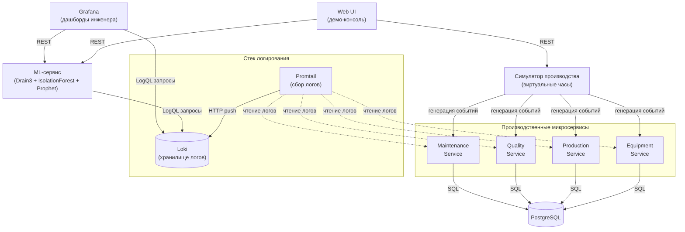

#vkr #day-01 #architecture

# День 1 — Архитектура и концепция системы

> Дата: 2026-05-09 Статус: ✅ завершён

---

# Contents

- [[#День 1 — Архитектура и концепция системы]]
    - [[#Цели на день]]
    - [[#Что сделано]]
        - [[#1 Окружение и инструменты]]
        - [[#2 Структура репозитория]]
        - [[#3 Архитектурные решения]]
            - [[#Стек технологий]]
            - [[#Поток данных запомнить наизусть для защиты]]
            - [[#Принцип стрелок UML-диаграммы]]
            - [[#Архитектурное разделение интерфейсов]]
        - [[#4 Симулятор и виртуальные часы]]
            - [[#Сценарии для демонстрации]]
        - [[#5 Концепция предметной области]]
            - [[#Тип производства]]
            - [[#Структура цеха 7 участков]]
            - [[#Аргумент про цену простоя]]
            - [[#Контекст и аргументация для записки]]
        - [[#6 Четыре микросервиса — назначение]]
        - [[#7 Артефакты]]
    - [[#План на завтра — День 2]]
        - [[#Подготовка 1 ч]]
        - [[#Минимальные реализации сервисов 3 ч]]
        - [[#Проверка 1 ч]]
        - [[#Что НЕ делаем завтра]]
        - [[#Что предстоит уточнить позже]]
    - [[#Заметки по сегодняшнему дню]]

---

## Цели на день

- [x] Создать структуру директорий проекта
- [x] Определиться с архитектурой и потоком данных
- [x] Зафиксировать выбор технологий
- [x] Нарисовать компонентную UML-диаграмму
- [x] Определиться с концепцией предметной области (завода)
- [x] Перенести диаграмму в Obsidian (Mermaid)

---

## Что сделано

### 1. Окружение и инструменты

-  Подтверждена готовность среды: Ubuntu 24.04 LTS, Docker 29.3, Compose v5.1, Git 2.43
-  Принято решение хранить проекты в `~/projects/`
-  Папка `~/docker-projects/` перенесена в `~/projects/docker-projects/`
-  Создан корень проекта: `~/projects/vkr-log-monitoring/`

### 2. Структура репозитория

```
~/projects/vkr-log-monitoring/
├── services/
│   ├── equipment/
│   ├── production/
│   ├── quality/
│   └── maintenance/
├── simulator/
├── webui/
├── ml/
├── postgres/init/
├── loki/
├── promtail/
└── grafana/provisioning/
    ├── datasources/
    └── dashboards/
```

-  Все 16 директорий созданы и проверены через `find . -type d`

**Принципиальное разделение:**

- `services/` — четыре FastAPI-сервиса бизнес-домена (то, что пишется самостоятельно)
- `ml/` — ядро ВКР, выделен отдельно для акцента на новизне работы
- `simulator/` — управляющий компонент для генерации событий и сценариев
- `webui/` — демо-консоль для защиты
- `loki/`, `promtail/`, `grafana/`, `postgres/` — конфиги для готовых образов из Docker Hub

### 3. Архитектурные решения

#### Стек технологий

-  **Стек логирования:** Grafana Stack (Loki + Promtail + Grafana) от Grafana Labs
- **База данных:** PostgreSQL для бизнес-данных сервисов
-  **ML-стек:** Drain3 + Isolation Forest (sklearn) + Prophet
-  **Backend:** FastAPI на Python для всех сервисов
-  **Frontend:** HTML + Vanilla JS + Tailwind CSS + Chart.js (без сборки, через CDN)
- **Раздача Web UI:** Nginx-контейнер
- **Контейнеризация:** Docker + Docker Compose v2

#### Поток данных (запомнить наизусть для защиты)



#### Принцип стрелок UML-диаграммы

**Стрелка показывает инициатора вызова, а не направление потока данных.**

Применение:

- Web UI инициирует запросы → стрелки от Web UI к ML и Симулятору
- Promtail сам читает файлы логов → стрелка от Promtail к сервисам
- ML и Grafana сами опрашивают Loki → стрелки от них к Loki
- Grafana сама опрашивает ML за метриками → стрелка от Grafana к ML

#### Архитектурное разделение интерфейсов

- **Web UI** — демо-консоль для защиты: управление симулятором + live-аналитика
- **Grafana** — инструмент инженера: глубокая аналитика, LogQL-запросы, история

В записке формулируется как **два режима развёртывания**:

- **Demo Mode (для ВКР):** симулятор включён + Web UI + Grafana
- **Production Mode (целевое развёртывание):** реальное оборудование + только Grafana

### 4. Симулятор и виртуальные часы

- Принято решение делать **полноценный симулятор с UI**
- Зафиксирована необходимость **виртуальных часов** с управлением скоростью (×1, ×10, ×100, ×1000)
- Без ускорения времени демонстрация невозможна: Prophet требует двухнедельных данных

#### Сценарии для демонстрации

- [ ] Нормальная работа (фон без событий)
- [ ] Перегрев оборудования
- [ ] Каскадный отказ
- [ ] Вспышка брака
- [ ] Тихая деградация

### 5. Концепция предметной области

#### Тип производства

- Отрасль: **машиностроение**, дискретное производство
- Профиль: **специализированный цех при автозаводе**
- Продукция: **цилиндрические косозубые шестерни** для коробок передач
- Номенклатура: **4-6 типоразмеров** под конкретные модели КПП

#### Структура цеха (7 участков)

1. Заготовительный (резка прутка)
2. Токарный (предварительная обработка)
3. Зубообрабатывающий (нарезание зубьев)
4. Термический (цементация, закалка, отпуск)
5. Шлифовальный (финиш после термообработки)
6. Контрольный (CMM, эвольвентомеры)
7. Упаковка и склад

#### Аргумент про цену простоя

Простой цеха шестерён → простой сборки КПП → простой главного автомобильного конвейера. Каскад. Реалистичная оценка: **миллионы рублей в час**.

#### Контекст и аргументация для записки

Российский контекст, обоснование:

> «На многих российских предприятиях машиностроения цифровизация процессов мониторинга находится на низком уровне. Целью настоящей работы является разработка прототипа доступной системы централизованного логирования и интеллектуального анализа на основе open-source технологий, которая может быть внедрена на средних российских предприятиях без значительных капитальных затрат на коммерческое ПО.»

### 6. Четыре микросервиса — назначение

-  **Equipment Service** — состояние оборудования, датчики, PLC-события (класс: **SCADA**)
-  **Production Service** — заказы, партии, маршруты, производительность (класс: **MES**)
-  **Quality Service** — измерения деталей, контроль качества, SPC (класс: **QMS**)
- **Maintenance Service** — неисправности, наряды на ремонт, ТО (класс: **CMMS**)

Эти четыре аббревиатуры — основа для защиты:

> «Микросервисная архитектура реализует функциональность четырёх классов промышленного ПО: SCADA для контроля оборудования, MES для управления производством, QMS для контроля качества и CMMS для управления обслуживанием.»

### 7. Артефакты

- PlantUML-код компонентной диаграммы
- PNG-экспорт диаграммы из plantuml.com
- Mermaid-версия для Obsidian
- Конспект Docker — темы 1-3 (с исправлениями: layer caching, exec form, EXPOSE, --pull=never)

---

## План на завтра — День 2

> Цель: создать минимальные FastAPI-заглушки для всех четырёх сервисов с структурированным JSON-логированием.

### Подготовка (1 ч)

- [ ] Изучить структурированное JSON-логирование в FastAPI:
    - https://www.sheshbabu.com/posts/fastapi-structured-logging/
    - https://apitally.io/blog/fastapi-logging-guide (раздел python-json-logger)

### Минимальные реализации сервисов (3 ч)

Для **каждого** из четырёх сервисов (`equipment`, `production`, `quality`, `maintenance`):

- [x] Создать `main.py` с FastAPI-приложением
- [x] Эндпоинт `/health` для проверки живости
- [x] 2-3 заглушечных эндпоинта по теме сервиса (без бизнес-логики, только генерация логов)
- [x] Подключить `python-json-logger` для структурированных логов в stdout
- [x] Стандартизировать схему лога: `timestamp`, `level`, `service`, `event`, `entity_id`, `details`
- [x] Создать `requirements.txt` с зависимостями
- [x] Создать `Dockerfile` (`python:3.12-slim` + `uvicorn`, exec form, правильный порядок layer caching)

### Проверка (1 ч)

- [x] Запустить каждый сервис локально через `uvicorn`
- [x] Убедиться, что в stdout пишется валидный JSON (можно проверить через `| jq`)
- [x] Сделать пробный запрос к `/health` каждого сервиса

### Что НЕ делаем завтра

- ❌ Симулятор и сценарии
- ❌ Бизнес-логику внутри сервисов
- ❌ Подключение к Loki/Promtail
- ❌ ML-сервис
- ❌ Web UI

> Цель дня 2 — **четыре говорящих заглушки**, которые умеют писать структурированные логи в stdout. Всё остальное — следующие дни.

### Что предстоит уточнить позже

- [ ] Конкретные модели станков на каждом из 7 участков (поиск информации в день 4-5)
- [ ] Конкретные параметры в логах для каждого типа оборудования
- [ ] Реалистичные сценарии аномалий по предметной области
- [ ] SQL-схема для PostgreSQL (день 3-4)

---

## Заметки по сегодняшнему дню

- Полное понимание архитектуры даёт уверенность для последующих дней
- Главное правило UML-стрелок: инициатор → вызываемый
- Главное правило Dockerfile: зависимости копируются и устанавливаются ДО исходного кода
- Главное правило CMD: только exec form для серверных приложений
- Открытие дня: open-source стек Grafana Labs соответствует уровню коммерческих аналогов Splunk/Datadog