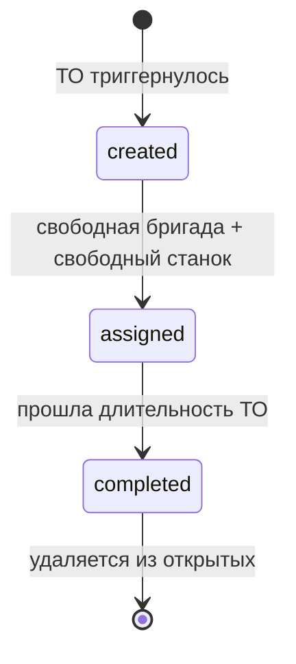

#vkr #day-05 #simulator #architecture

# Логика симулятора завода (без кода)

> Документ описывает **что и как** должно работать в симуляторе. Без Python-кода, без реализации — только архитектурные решения и поведение. Конкретная реализация будет писаться по этому документу.

---

# Contents

- [[#1. Общая концепция]]
- [[#2. Виртуальное время]]
- [[#3. Главный цикл и тик]]
- [[#4. Состояние симулятора в памяти]]
- [[#5. Порядок работы подсистем]]
- [[#6. Подсистема Orders — генерация заказов]]
- [[#7. Подсистема Production — диспетчер партий]]
- [[#8. Подсистема Equipment — циклы станков]]
- [[#9. Подсистема Furnace — особая логика печи]]
- [[#10. Подсистема Quality — контроль качества]]
- [[#11. Подсистема Maintenance — плановое ТО]]
- [[#12. WebUI — веб-интерфейс]]
- [[#13. Сводка числовых параметров]]
- [[#14. Что НЕ моделируем]]
- [[#15. Резюме архитектурных решений]]

---

## 1. Общая концепция

### 1.1. Что делает симулятор

Симулятор — это отдельный процесс (FastAPI-сервис на порту 8005), который **имитирует работу автомобильного шестерёночного завода**. Он не производит ничего физического, но генерирует поток событий: создаёт заказы, движет партии по производственной цепочке, эмулирует показания датчиков, фиксирует завершение операций.

Каждое событие отправляется HTTP-запросом одному из четырёх backend-сервисов (equipment, production, quality, maintenance), которые пишут его в PostgreSQL и в Loki/Grafana.

### 1.2. Что симулятор НЕ делает

- **Не пишет в БД напрямую** — только через HTTP к backend-сервисам. Это правильное архитектурное разделение: симулятор — «внешний мир», БД — внутренняя кухня сервисов.
- **Не моделирует сценарии аномалий** — это отдельная задача после готового симулятора.
- **Не делает реалистичную физику** — упрощённые формулы достаточны для генерации датасета.
- **Не сохраняет состояние** между перезапусками — рестарт контейнера = новый прогон с чистого листа.

### 1.3. Почему именно так

- **Изоляция.** Сервисы equipment/production/quality/maintenance не знают о симуляторе. Для них он — обычный HTTP-клиент, неотличимый от реальной SCADA. Завтра завод подключат — те же сервисы будут работать без изменений.
- **Управляемость.** Все органы управления (Start/Pause/Speed) — в одном месте, через WebUI.
- **Простота.** Один процесс, одна память, одно состояние. Никаких очередей сообщений, никакой синхронизации между симуляторами.

---

## 2. Виртуальное время

### 2.1. Зачем виртуальное время

Реальный завод работает медленно. Одна шестерня на hobbing — 10 минут. Цикл цементационной печи — 8 часов. Если симулятор работает с такими интервалами в реальном времени, за час реального демо мы получим ~20 минут «производства». Никакого датасета для ML.

Поэтому используется **виртуальное время** — независимое от реального, ускоряемое множителем.

### 2.2. Как работает

Есть отдельный объект `VirtualClock`, который хранит «виртуальный момент сейчас». При каждом тике главного цикла он продвигается на `0.1 секунды × speed`:

- При **скорости ×1** — синхронно с реальным
- При **×10** — 10 минут реального = 100 минут виртуального
- При **×100** — час реального = 4 виртуальных дня
- При **×1000** — час реального = почти 42 виртуальных дня

Все события, отправляемые в сервисы, содержат поле `event_time` — текущее виртуальное время в момент эмита. Backend-сервисы используют это время вместо `NOW()` при записи в базу. Виртуальное время становится единственным временем в логах.

### 2.3. Управление часами

- **pause** — часы замораживаются, `now()` возвращает текущее значение, симулятор «спит»
- **resume** — часы продолжаются с того момента, где встали
- **set_speed(x)** — смена множителя без скачков (rebase pattern)

### 2.4. Состояние при перезапуске

Виртуальные часы живут в памяти. После рестарта контейнера часы стартуют с начального момента заново. Логи в Loki за предыдущий прогон могут перемешаться с новыми. Это нормально — мы не персистим, чисто новый прогон.

---

## 3. Главный цикл и тик

### 3.1. Что такое тик

**Тик** — одна итерация главного цикла симулятора. На каждом тике:

1. Виртуальное время продвигается на `0.1 × speed` секунд
2. Поочерёдно вызываются все подсистемы (см. §5)
3. Каждая подсистема обходит свои объекты и эмитит события
4. После всех подсистем — пауза 100 мс реального времени (`sleep`)
5. Затем следующий тик

Цикл работает **в отдельном фоновом потоке** (background thread), чтобы FastAPI-эндпоинты (`/status`, `/start` и т.д.) могли отвечать параллельно.

### 3.2. Что такое главный цикл

**Главный цикл** (main loop) — бесконечный `while`, который крутится в фоновом потоке, пока симулятор не остановлен. Он реализует ритм работы симулятора. Без главного цикла подсистемы — мёртвые объекты в памяти.

Главный цикл реагирует на три сигнала из основного потока FastAPI:

- **start** — запустить цикл (создать поток)
- **pause** — приостановить (поток продолжает крутиться, но виртуальные часы заморожены, и подсистемы пропускают тики)
- **resume** — продолжить с паузы
- **stop** — остановить поток полностью

### 3.3. Почему именно 100 миллисекунд

Можно было сделать тик 10 мс или 1 секунду. Почему именно 100 мс?

- **10 мс** — слишком часто. На скорости ×1 за тик проходит 10 мс виртуального — между sensor_readings (15 секунд) проходит 1500 пустых тиков. CPU вхолостую.
- **1 секунда** — слишком редко. На скорости ×1000 за тик проходит 1000 виртуальных секунд (16 минут). Это перескок через все sensor_readings (которые каждые 15 сек) и значимые события. Куски «производства» пропадают.
- **100 мс** — компромисс. На ×1 один тик = 100 мс виртуального, на ×1000 — 100 секунд. Это меньше любого интересного интервала (15-секундный sensor) с запасом.

### 3.4. Поведение на высоких скоростях

На скорости ×1000 за тик проходит ~100 виртуальных секунд. Это значит, что:

- Между двумя тиками могут пройти 6-7 интервалов sensor_reading
- Подсистема Equipment на одном тике может эмитить ~6 событий sensor_reading подряд для одного станка (по одному за прошедший 15-секундный интервал)

Это нормально. Подсистема не «теряет» события — она их догоняет, эмитя несколько на одном тике.

### 3.5. Безопасность параллельного доступа

Фоновый поток меняет состояние на каждом тике (создаёт партии, двигает их, меняет станки). FastAPI-эндпоинт `/status` читает это состояние, чтобы вернуть его WebUI. Если эти два потока встретятся посередине обновления, `/status` вернёт «полусломанный» снимок: новые партии уже добавлены, а станки ещё не обновлены.

Решение — **lock (мьютекс)**. Каждое изменение состояния и каждое чтение снимка проходит через один общий lock. Это гарантирует атомарность: либо весь тик завершён до чтения, либо чтение завершено до тика.

---

## 4. Состояние симулятора в памяти

Симулятор хранит всё «состояние мира» в памяти, в одном объекте. Это:

- **Станки** — 16 машин: 3 токарных, 4 зубофрезерных, 2 шевинговальных, 2 печи, 3 шлифовальных, 2 контрольных. Для каждого — его тип, текущее состояние, текущая партия (если есть), износ инструмента и т.д.
- **Партии** — активные партии в системе. Каждая знает свой `product_code`, количество, текущую стадию, текущий станок.
- **Заказы** — список созданных заказов с привязкой к партиям.
- **Очереди** — 7 FIFO-очередей между участками (см. §7.2).
- **Загрузки печи** — для каждой из двух печей: что сейчас в ней, какая стадия, когда стартовала.
- **Бригады** — 3 ремонтные бригады, для каждой — занята/свободна.
- **Открытые наряды на ТО** — список созданных, но не завершённых нарядов.

Всё это живёт в памяти процесса. При рестарте — обнуляется (16 станков снова в idle, очереди пустые, заказов нет).

---

## 5. Порядок работы подсистем

### 5.1. Шесть подсистем

Симулятор разделён на шесть подсистем, каждая отвечает за свой кусок логики:

1. **Orders** — генерация заказов
2. **Production** — диспетчер партий между участками
3. **Equipment** — циклы обычных станков (без печи)
4. **Furnace** — отдельная подсистема для batch-логики печи
5. **Quality** — измерения и инспекция
6. **Maintenance** — плановые ТО и бригады

### 5.2. Строгий порядок вызова

На каждом тике подсистемы вызываются именно в таком порядке. Это **не случайно**:

**Orders первая** — если на этом тике появилась новая партия, она сразу окажется в очереди `pending`, и Production сможет её увидеть в том же тике.

**Production до Equipment** — диспетчер сначала распределяет партии по свободным станкам, потом Equipment крутит на занятых. Иначе на следующем тике станок ещё минуту простоял бы вхолостую.

**Equipment до Furnace** — когда партия закончится на Hobbing/Shaving, она попадёт в очередь `waiting_furnace`. Furnace в том же тике может её забрать.

**Quality после Equipment** — реагирует на завершение цикла на inspection (которое случилось в Equipment).

**Maintenance в конце** — может остановить станки, но эффект увидится только на следующем тике. Это не страшно.

### 5.3. Естественная задержка между подсистемами

Внутри одного тика порядок строгий. Между двумя тиками — пауза 100 мс реального времени. Это значит, что если в Equipment-тике партия закончилась на hobbing, она попадёт в очередь, но **Production двинет её дальше только в следующем тике** (через 100 мс реального, через 100-100000 мс виртуального).

Эта задержка незаметна для логов и аналитики, но создаёт детерминированный и предсказуемый порядок событий.

---

## 6. Подсистема Orders — генерация заказов

### 6.1. Когда генерируется новый заказ

Каждые **20–40 виртуальных минут** (случайно в этом диапазоне). После генерации текущего ордера подсистема планирует следующий: «следующий ордер через X минут», где X выбирается случайно. На каждом тике подсистема проверяет: «прошло ли время следующего ордера?» Если да — генерирует.

### 6.2. Параметры заказа

Каждый ордер имеет:

**Уникальный ID** — например, `ORD-2026-0042`. Последовательный счётчик.

**Продукт** (`product_code`) — один из четырёх типоразмеров с весами:

- SPUR-S (малая прямозубая) — 35%
- SPUR-M (средняя прямозубая) — 30%
- HEL-M (средняя косозубая) — 20%
- HEL-L (большая косозубая) — 15%

**Количество** — равновероятно одно из значений: 100, 200, 300 шт. Стандартные размеры, чтобы не было «магических» 357 или 218.

**Приоритет** — с весами:

- normal — 75% (обычные заказы)
- urgent — 20% (важные)
- rush — 5% (срочные)

### 6.3. Разбиение на партии

Сразу после создания ордер разбивается на партии. Размер партии зависит от **приоритета**:

- **rush** → партии по **25 шт** (мелкие, чтобы быстрее переключаться)
- **urgent** → партии по **50 шт**
- **normal** → партии по **80 шт** (крупные, для эффективности)

**Логика разделения:** срочный заказ хочется быстрее провести через линию. Если он 200 шт с приоритетом rush — 8 мелких партий по 25 будут шустрее «протекать» через очереди, чем 2 толстые по 80, которые ждут полного цикла.

**Примеры:**

- Ордер 300 шт, normal → 4 партии: 80 + 80 + 80 + 60
- Ордер 100 шт, rush → 4 партии: 25 + 25 + 25 + 25
- Ордер 200 шт, urgent → 4 партии: 50 + 50 + 50 + 50

### 6.4. Куда попадают созданные партии

Все партии после создания попадают в общую FIFO-очередь `pending`. Это первая очередь системы, перед турнингом. Production-диспетчер на следующем тике начнёт её разбирать.

### 6.5. Что отправляется в сервисы

- В **production-сервис**: `order_creation` (новый заказ) — один раз
- В **production-сервис**: `batch_created` (на каждую партию) — N раз

---

## 7. Подсистема Production — диспетчер партий

### 7.1. Главный принцип: «партия целиком на станке»

Самое важное архитектурное решение симулятора: **один станок обрабатывает одну партию целиком**. Пока 80 деталей не пройдены на M-HOB-02, он не возьмёт следующую партию.

**Это НЕ потоковая обработка**, где детали идут по конвейеру одна за другой между разными станками. У нас партия захватывает станок целиком и держит до конца цикла.

**Почему именно так:**

- Соответствует реальному серийному производству, где партии перемещаются в кассетах/контейнерах между участками
- Радикально упрощает state machine станка и отслеживание партий
- Параллелизм всё равно сохраняется на уровне разных участков: партия A на grinding, партия B на hobbing, партия C на turning — одновременно

### 7.2. Очереди перед каждым участком

У нас есть 7 FIFO-очередей:

1. **pending** — перед turning (сюда падают новые партии)
2. **turning** — после турнинга, перед hobbing
3. **hobbing** — после hobbing, перед shaving (для SPUR-M/HEL-M) или сразу перед waiting_furnace
4. **shaving** — после shaving, перед waiting_furnace
5. **waiting_furnace** — перед печью, **с особой логикой** (см. §9)
6. **heat_treatment** — после печи, перед grinding
7. **grinding** — после grinding, перед inspection

Имя ключа очереди — название **только что завершённого** участка. Все обычные очереди — стандартный FIFO: первая пришла, первая взялась на свободный станок. Только `waiting_furnace` имеет особую логику.

### 7.3. Маршруты продуктов

Маршрут зависит от типа шестерни:

- **SPUR-S** (малая прямозубая): turning → hobbing → heat_treatment → grinding → inspection (без shaving — малые детали не требуют)
- **SPUR-M** (средняя прямозубая): turning → hobbing → **shaving** → heat_treatment → grinding → inspection
- **HEL-M** (средняя косозубая): turning → hobbing → **shaving** → heat_treatment → grinding → inspection
- **HEL-L** (большая косозубая): turning → hobbing → heat_treatment → grinding → inspection (без shaving — после термообработки идёт полное шлифование)

Каждая партия «знает» свой маршрут по `product_code`. При завершении на участке диспетчер смотрит маршрут партии и помещает её в очередь следующего шага.

### 7.4. Логика диспетчера на тике

На каждом тике подсистема последовательно проходит по очередям:

1. Берёт очередь `pending`, ищет свободные токарные станки (idle). Если есть — берёт партию из головы очереди, ставит на станок (переводит станок в setup).
2. Берёт очередь `turning`, ищет свободный hobbing-станок. Аналогично.
3. После hobbing подсистема смотрит маршрут партии:
    - если в маршруте есть shaving → партия попадает в очередь `hobbing` для shaving
    - если нет → сразу в `waiting_furnace`
4. После shaving — всегда в `waiting_furnace`
5. **Печь** обрабатывается отдельной подсистемой Furnace (см. §9)
6. После термообработки — в очередь `heat_treatment`, диспетчер ищет свободный grinding
7. После grinding — в `grinding`, диспетчер ищет свободный inspection

### 7.5. Что значит «поставить партию на станок»

Это атомарная операция:

1. Партия удаляется из головы очереди
2. У неё обновляется текущая стадия и текущий станок
3. У станка обновляется текущая партия и состояние (idle → setup)
4. Шлются два события: `batch_move` в production-сервис и `state_change` в equipment-сервис

После этого станок в setup, и Equipment-подсистема на этом или следующем тике запустит на нём цикл.

### 7.6. Параллелизм между участками

Хотя один станок занят одной партией, разные участки работают параллельно. В момент времени T может быть:

- M-LATHE-01: партия B-0042 в running (turning)
- M-LATHE-02: партия B-0043 в setup
- M-HOB-01: партия B-0041 в running (hobbing)
- M-HOB-02: idle
- M-FRN-01: загрузка из 78 деталей в carburizing
- M-GRD-01: партия B-0038 в running (grinding)
- M-CMM-01: партия B-0035 в running (inspection)

Все эти процессы продвигаются на каждом тике параллельно. Поток событий — сразу со всех участков.

### 7.7. Что отправляется в сервисы

- `batch_move` — при каждом переходе партии между участками
- `state_change` — у станка (idle → setup), когда диспетчер ставит партию

---

## 8. Подсистема Equipment — циклы станков

### 8.1. Что обрабатывает

Равно все обычные станки: turning, hobbing, shaving, grinding, inspection. **Печь обрабатывается отдельно** — у неё другая логика (см. §9).

### 8.2. Состояния станка

Станок имеет одно из состояний:

- **idle** — простаивает, ждёт партию
- **setup** — наладка, готовится к обработке
- **running** — обрабатывает партию
- **tool_change** — смена инструмента в процессе
- **maintenance** — на плановом ТО
- **fault** — поломка (в нормальном режиме практически не происходит)

### 8.3. Цикл обработки партии

Когда диспетчер ставит партию на станок:

1. Станок переходит в **setup**. Длительность setup — фиксированная 2 виртуальные минуты. Это эмуляция установки заготовок и наладки инструмента.
2. По истечении setup-времени станок переходит в **running**.
3. В running станок «обрабатывает» детали последовательно. Длительность одного цикла зависит от типа станка:
    - turning — 4 минуты на деталь
    - hobbing — **10 минут на деталь (узкое место завода!)**
    - shaving — 2 минуты на деталь
    - grinding — 3 минуты на деталь
    - inspection — 1 минута на инспектируемую деталь
4. После каждой обработанной детали в equipment-сервис идёт событие `cycle_completion`.
5. Износ инструмента (`tool_wear`) увеличивается на маленькое значение после каждого цикла. Например, на hobbing — 0.25% за цикл, полный износ за ~400 циклов.
6. Когда все детали в партии обработаны — станок возвращается в idle, партия попадает в очередь следующего участка через диспетчер.

### 8.4. Generation of sensor_reading

Пока станок в running, **каждые 15 виртуальных секунд** он шлёт `sensor_reading` в equipment-сервис. В одном событии — снимок **всех** сенсорных параметров станка одновременно: обороты шпинделя, нагрузка, температура подшипников, виброскорость, температура СОЖ и т.д.

Каждый тип станка имеет свой набор параметров. Например, у hobbing — 8 параметров (hob_spindle_rpm, work_spindle_rpm, axial_feed_rate, spindle_load_percent, vibration_rms, hob_bearing_temp, cutting_oil_temp, cutting_oil_flow). У шлифовального — другие 7. У инспекционной машины — только параметры окружающей среды (ambient_temp, humidity, air_pressure).

**Значения генерируются** как случайные в нормальном диапазоне с небольшим разбросом (например, spindle_load_percent = mean 62% ± 6%). Это **нормальный режим** работы — без аномалий. Случайный разброс делает данные «живыми», непредсказуемыми, но в пределах допусков.

### 8.5. Tool change

Когда `tool_wear` достигает 1.0, инструмент считается изношенным:

1. Станок переходит в особое состояние **tool_change**
2. Длительность — 5 виртуальных минут (фиксированно)
3. После завершения `tool_wear` сбрасывается в 0, станок возвращается в running и продолжает партию

В реальности tool_change случается раз в ~80–400 циклов в зависимости от типа станка. Это нормальная плановая операция, которая периодически создаёт паузу в работе станка.

### 8.6. Что отправляется в equipment-сервис

- `state_change` — при каждом переходе состояния (idle → setup, setup → running, running → tool_change, tool_change → running, running → idle)
- `sensor_reading` — каждые 15 виртуальных секунд в running
- `cycle_completion` — после каждой обработанной детали
- `tool_change` — при смене инструмента (отдельное событие)
- `batch_completion_on_stage` — в production-сервис, когда партия закончилась на этом станке

---

## 9. Подсистема Furnace — особая логика печи

Печь — самая сложная подсистема симулятора. Все обычные станки работают по общему шаблону. Печь — по своему.

### 9.1. Чем печь отличается

- **Batch-процесс**, не поштучный. За одну загрузку печь обрабатывает до **80 деталей одновременно**.
- **Очень долгий цикл** — около 8 виртуальных часов на одну загрузку.
- **Жёсткое ограничение**: в одной загрузке должны быть детали только **одного product_code**. Разные продукты требуют разной температуры цементации, разной глубины слоя, разного углеродного потенциала. Смешивание невозможно.
- **Много стадий внутри одного цикла** — 6 разных «состояний», каждое со своими сенсорными параметрами.

### 9.2. Очередь перед печью

Все партии, прошедшие hobbing или shaving, попадают в очередь `waiting_furnace`. Это **не обычная FIFO**, потому что взятие партий в печь зависит от состава очереди и от их продукта.

### 9.3. Алгоритм выбора следующей загрузки

Когда любая из двух печей освобождается, подсистема Furnace на этом тике:

1. Смотрит **голову очереди** `waiting_furnace` — её product_code (например, SPUR-S).
2. Из всей очереди отбирает **все** партии того же product_code, по порядку с головы.
3. Суммирует количество деталей. Если сумма ≤ 80 — все эти партии идут в загрузку. Если выходит за 80 — останавливается на той партии, что не помещается.
4. Решает, **стартовать ли загрузку**, по трём условиям (любое из них):
    - **Заполнение ≥ 60%** (48+ деталей) — стартуем, не ждём добора
    - **Голова очереди ждёт ≥ 30 виртуальных минут** — стартуем, даже если заполнено меньше 60%
    - **Среди отобранных партий есть rush-приоритет** — стартуем немедленно
5. Если ни одно условие не выполнено — ждём ещё, ничего не загружаем.

**Пример работы.** В очереди (с головы):

- B1 = SPUR-S, 50 шт
- B2 = SPUR-M, 80 шт
- B3 = SPUR-S, 30 шт
- B4 = HEL-L, 50 шт

Голова — B1 (SPUR-S). Подсистема набирает партии с тем же product_code: B1 (50) + B3 (30) = 80 шт SPUR-S. Заполнение 100% → стартуем. Партии B2 (SPUR-M) и B4 (HEL-L) **пропускаются** и остаются в очереди для следующих загрузок.

### 9.4. Зачем такая логика — recipe-based campaign scheduling

Этот принцип называется **«recipe-based campaign scheduling»** — индустриальная практика, описанная у производителей печей (Eurotherm, Surface Combustion, Paulo). Идея: партии с одинаковым «рецептом» (продуктом) группируются в одну «кампанию» обработки. Это позволяет:

- Не переключать set-points температуры между загрузками
- Не менять углеродный потенциал атмосферы
- Сохранять стабильные параметры цементации

В реальном производстве это даёт повторяемость качества и экономию энергии.

### 9.5. Стадии цикла печи

После старта загрузки печь проходит **шесть стадий последовательно**:

|Стадия|Длительность|Что происходит|
|---|---|---|
|**loading**|5 минут|Загрузка деталей в печь|
|**heating**|120 минут (2 часа)|Разогрев до 927°C|
|**carburizing**|240 минут (4 часа)|Цементация при 927°C: boost-фаза с углеродным потенциалом 1.1%, потом diffuse-фаза с 0.85%|
|**quenching**|30 минут|Резкая закалка в масло при ~65°C|
|**tempering**|90 минут (1.5 часа)|Отпуск при 177°C для снятия напряжений|
|**unloading**|5 минут|Выгрузка готовых деталей|

**Итого: ~490 минут (8 часов 10 минут) виртуального времени** на одну полную загрузку.

Эти числа основаны на реальной практике в массовом производстве шестерён (см. подкаст Heat Treat Radio #105 и обзоры Gear Solutions).

### 9.6. Что происходит на каждой стадии

На каждом тике подсистема:

1. Смотрит, прошло ли запланированное время текущей стадии
2. Если да — переходит к следующей стадии и шлёт `state_change` в equipment-сервис
3. Шлёт `sensor_reading` (каждые 15 виртуальных секунд) с параметрами, характерными для текущей стадии:

|Стадия|Что в sensor_reading|
|---|---|
|heating|Температура в 3 зонах растёт от ~760 до 927°C; atmosphere_pressure ~1010 mbar; Cp ~0.4%|
|carburizing|Все 3 зоны = 927°C ± 4°C; pressure ~1015 mbar; Cp = 1.10 ± 0.05 (boost) или 0.85 ± 0.05 (diffuse)|
|quenching|quench_oil_temp 65°C; quench_oil_flow 0.75 м/с; температуры в зонах падают до 843°C|
|tempering|Все 3 зоны = 177°C ± 3°C|

Каждая стадия имеет свой профиль — это разнообразит датасет.

### 9.7. Что происходит после unloading

Когда печь завершает unloading:

1. Все партии этой загрузки помечаются как прошедшие heat_treatment
2. Партии передвигаются в очередь `heat_treatment` (перед grinding)
3. Печь переходит в idle и готова к следующей загрузке
4. На следующем тике подсистема может сразу начать формировать новую загрузку (если в `waiting_furnace` есть подходящие партии)

### 9.8. Что отправляется

- В **equipment-сервис**: `state_change` на каждой смене фазы, `sensor_reading` (печные датчики)
- В **production-сервис**: `batch_move` для каждой партии после unloading

---

## 10. Подсистема Quality — контроль качества

### 10.1. Когда генерируются измерения

На участке inspection обычные `cycle_completion` идут от Equipment (как у обычного станка). Но кроме них **Quality** для выборочных деталей генерирует подробные геометрические измерения.

### 10.2. Алгоритм выборки 10%

Когда партия попадает на inspection, подсистема **случайно выбирает 10%** порядковых номеров деталей (минимум одну). Например, в партии 80 деталей — выбираются 8 случайных номеров (3-я, 7-я, 14-я, 23-я, 38-я, 51-я, 65-я, 79-я).

Когда Equipment-подсистема завершает цикл для очередной детали, она проверяет: попадает ли её порядковый номер в выборку? Если да — Quality эмитит для неё `measurement_set`.

В реальности это соответствует тому, что **не каждая деталь** идёт на координатно-измерительную машину — только выборка по статистическому плану.

### 10.3. Какие измерения

Для каждой инспектируемой детали — 3–5 случайно выбранных параметров из набора:

- **profile_deviation** — отклонение профиля зуба от идеальной эвольвенты, мкм
- **lead_deviation** — отклонение направления зуба, мкм
- **pitch_deviation** — отклонение шага между зубьями, мкм
- **runout** — биение шестерни, мкм
- **surface_roughness** (Ra) — шероховатость поверхности, мкм

### 10.4. Допуски (класс точности AGMA Q10–Q11)

Используем класс точности AGMA Q10–Q11 (≈ ISO 6-7), реалистичный для автомобильных шестерён после grinding:

- profile_deviation: 0–14 мкм
- lead_deviation: 0–16 мкм
- pitch_deviation: 0–12 мкм
- runout: 0–22 мкм
- surface_roughness: 0.0–1.2 мкм

Значения генерируются как случайные в этих диапазонах. Каждое значение независимо.

### 10.5. Решение pass/fail

После всех измерений детали:

1. Если хоть одно значение **вышло за допуск** → fail (формально это маловероятно в normal-режиме, потому что значения по построению в допуске; но если бы было нарушение — это сразу fail)
2. Иначе **с вероятностью 1.5%** (фоновый брак) → fail
3. Иначе → pass

Эта фоновая случайная вероятность нужна, чтобы датасет был реалистичным. Даже идеальное производство имеет 1–2% случайного брака — это нормально. Без неё ML-модель не научится отличать «фоновый шум брака» от «настоящих аномалий».

### 10.6. Что отправляется

- `measurement_set` (3–5 значений) — в quality-сервис, для каждой инспектируемой детали
- `inspection_result` (pass/fail) — в quality-сервис, после всех измерений детали

---

## 11. Подсистема Maintenance — плановое ТО

### 11.1. Три ремонтные бригады

В системе есть три одинаковых бригады механиков:

- B-MECH-01
- B-MECH-02
- B-MECH-03

Все бригады одинаковые — могут делать любой ТО на любом станке. Различие только для статистики «нагрузка по бригадам» в дашборде. Это упрощение — в реальности были бы электрики, гидравлики, термисты отдельно. У нас 3 одинаковые.

### 11.2. Когда создаётся наряд

Для каждого станка ведутся два счётчика с момента последнего ТО:

- Количество циклов: `cycles_since_maintenance`
- Время в часах: с момента `last_maintenance_at`

ТО триггерится **первым из условий**:

- Прошло **500 циклов** обработки, ИЛИ
- Прошло **72 виртуальных часа**

Когда любое условие сработало, подсистема создаёт новый work_order на этот станок.

### 11.3. Жизненный цикл наряда

- **created** — наряд только что создан, ждёт назначения. Если все бригады заняты или станок ещё крутит партию — наряд просто ждёт в очереди (она в этом случае не FIFO, а просто список открытых).
- **assigned** — наряд назначен свободной бригаде, она работает. Станок переведён в maintenance.
- **completed** — ТО завершено. Наряд удаляется. Станок снова в idle, бригада свободна.

### 11.4. Назначение наряда бригаде

На каждом тике подсистема проходит по нарядам в состоянии `created`. Для каждого:

1. Ищет свободную бригаду (`is_busy = False`)
2. **Важно**: проверяет, что станок-цель свободен (в состоянии idle). Нельзя прервать обработку партии — наряд ждёт, пока станок не освободится сам.
3. Если нашлась пара (свободная бригада + свободный станок):
    - Бригада → busy
    - Наряд → assigned
    - Станок → maintenance
    - Шлются `work_order_assigned` и `state_change`

### 11.5. Длительность ТО

После назначения ТО длится **30–60 виртуальных минут** (случайно в диапазоне). По истечении:

- Наряд → completed (удаляется из открытых, отправляется `work_order_completed`)
- Бригада → not busy
- Станок → idle (отправляется `state_change`)
- Счётчик `cycles_since_maintenance` обнуляется
- Износ инструмента `tool_wear` обнуляется (заменили инструмент)
- `last_maintenance_at` обновляется на текущее виртуальное время

### 11.6. Что отправляется

- В **maintenance-сервис**: `work_order_created`, `work_order_assigned`, `work_order_completed`
- В **equipment-сервис**: `state_change` (idle → maintenance → idle)

---

## 12. WebUI — веб-интерфейс

### 12.1. Принципы

- **Простая HTML-страница** со скриптом `app.js`. Никаких фреймворков (React/Vue не нужны).
- Подаётся самим симулятором через FastAPI: статика монтируется через `StaticFiles`, корень `/` возвращает `index.html`.
- Содержит **только отображение и кнопки**. Никакой логики, никакого состояния — всё в backend.
- Обновляется через **polling**: `setInterval(fetchStatus, 1000)` — раз в секунду запрашивает `/status` и перерисовывает.

### 12.2. Что показывает

**Header (вверху):**

- Текущее виртуальное время (большим шрифтом)
- Текущая скорость (×1 / ×10 / ×100 / ×1000)
- Статус (running / paused / stopped)
- Кнопки: Start, Pause, Resume, Stop
- Кнопки выбора скорости: ×1, ×10, ×100, ×1000

**Машины** — сетка 4×4 из 16 ячеек. Каждая ячейка показывает:

- ID станка (например, M-HOB-01)
- Тип (hobbing)
- Текущее состояние (running / idle / setup / maintenance / tool_change)
- Цвет фона по состоянию: серый (idle), жёлтый (setup), зелёный (running), синий (maintenance), оранжевый (tool_change), красный (fault)
- Текущая партия (если есть)
- Tool wear (например, «65%»)

**Активные партии** — таблица:

- batch_id
- product_code
- текущая стадия (turning / hobbing / waiting_furnace / ...)
- текущий станок (если на станке)
- прогресс (например, «35 из 80»)

**Очередь печи** — отдельно, потому что важная и может расти. Список ID партий в `waiting_furnace`. Можно делать счётчик «N партий ожидают».

**Текущие загрузки печи** — для каждой из двух печей:

- Какая стадия (heating / carburizing / quenching / tempering / unloading)
- Какой product_code в загрузке
- Сколько деталей
- Когда стартовала (виртуальное время)

**Открытые наряды** — список работ на ТО:

- ID наряда
- Какой станок
- Состояние (created / assigned)
- Назначенная бригада (если assigned)

### 12.3. Polling, не WebSocket

Используется **polling** (опрос раз в секунду), не WebSocket. Причины:

- **Простота.** Один эндпоинт `/status`, никакой stateful-логики на сервере
- **Устойчивость.** Если симулятор перезапустится — UI просто продолжит запрашивать, никаких разорванных соединений
- **Достаточная скорость.** 1 запрос в секунду — пренебрежимая нагрузка. WebSocket был бы оправдан при > 5 обновлений/сек, что нам не нужно.

### 12.4. Структура файлов

- `webui/index.html` — HTML с разметкой
- `webui/app.js` — JavaScript: fetch /status, парсинг ответа, рендеринг
- `webui/style.css` — простые стили

### 12.5. Кнопки управления

Каждая кнопка — это AJAX-вызов соответствующего эндпоинта симулятора:

- Start → `POST /start`
- Pause → `POST /pause`
- Resume → `POST /resume`
- Stop → `POST /stop`
- ×N → `POST /speed?factor=N`

После клика — немедленный `fetchStatus()`, чтобы UI отразил новое состояние.

---

## 13. Сводка числовых параметров

Все «магические числа» — собраны в одном файле конфигурации, чтобы было легко настраивать.

### 13.1. Реальное время

- TICK_REAL_SEC = **0.1** (100 мс на тик)
- HTTP_TIMEOUT_SEC = **2.0**

### 13.2. Виртуальные тайминги (общие)

- SETUP_TIME_SEC = **120** (2 минуты наладки)
- SENSOR_INTERVAL_SEC = **15** (между sensor_readings)
- TOOL_CHANGE_DURATION_SEC = **300** (5 минут смена инструмента)

### 13.3. Время циклов на участках (виртуальное)

- turning: **240 секунд** (4 минуты)
- hobbing: **600 секунд** (10 минут) — **узкое место завода**
- shaving: **120 секунд** (2 минуты)
- grinding: **180 секунд** (3 минуты)
- inspection: **60 секунд** (1 минута на инспектируемую)

### 13.4. Износ инструмента за цикл

- turning: 0.40% (полный износ за ~250 циклов)
- hobbing: 0.25% (~400 циклов)
- shaving: 0.50% (~200 циклов)
- grinding: 0.33% (~300 циклов)

### 13.5. Параметры заказов

- Интервал между ордерами: **20–40 виртуальных минут** (случайно)
- Размеры ордеров: **100, 200, 300** шт (равновероятно)
- Размеры партий: rush=**25**, urgent=**50**, normal=**80**
- Веса приоритетов: normal **75%**, urgent **20%**, rush **5%**
- Веса продуктов: SPUR-S **35%**, SPUR-M **30%**, HEL-M **20%**, HEL-L **15%**

### 13.6. Параметры печи

- Вместимость одной загрузки: **80 деталей**
- Минимальное заполнение для старта: **60%** (48 деталей)
- Максимальное ожидание для добора: **30 виртуальных минут**
- Стадии: 5 + 120 + 240 + 30 + 90 + 5 = **490 минут** (8 ч 10 мин на полный цикл)

### 13.7. ТО

- Триггер по циклам: **500 циклов**
- Триггер по времени: **72 виртуальных часа**
- Длительность ТО: **30–60 виртуальных минут**
- Количество бригад: **3**

### 13.8. Контроль качества

- Выборка: **10%**
- Фоновый брак: **1.5%**
- Измерений на инспектируемую деталь: **3–5**
- Допуски (мкм): profile **14**, lead **16**, pitch **12**, runout **22**, Ra **1.2**

---

## 14. Что НЕ моделируем

Намеренные упрощения, которые **не делаются** в этой версии симулятора. Записываю явно, чтобы потом не было «забыли»:

- **Сценарии аномалий** — отдельная задача после готового симулятора.
- **Реальная физика износа** — `tool_wear` растёт линейно. В реальности — экспоненциально под конец срока службы.
- **Смены и выходные** — завод работает 24/7. Никаких ночных пауз, обеденных перерывов, выходных.
- **Re-work** — если деталь fail на инспекции, она просто помечается. В реальности часть отправляли бы на доработку — мы пропускаем.
- **Складские запасы заготовок** — считаем, что поковки на складе перед turning есть всегда.
- **Смешивание продуктов в одной загрузке печи** — запрещено правилом recipe-based scheduling.
- **Транспортные задержки между участками** — мойка, перемещение тележкой считаются включёнными в SETUP_TIME_SEC.
- **Поломки во время цикла** — fault не симулируется в нормальном режиме.
- **Динамическое перепланирование при сбоях** — если станок ушёл в fault, партия просто ждёт.
- **Реалистичные параметры по product_code** — на текущий момент SPUR-S и HEL-L крутятся на станках с одинаковыми диапазонами сенсоров. В реальности параметры зависят от размера детали. Можно добавить отдельно — модификаторы профиля сенсоров по продукту.

---

## 15. Резюме архитектурных решений

1. **Гибрид DES + time-stepped** — не чистый Discrete Event Simulation. Фиксированный тик 100 мс реального времени, виртуальное время продвигается умножителем. Это для лёгкой интеграции с HTTP и WebUI.
    
2. **Один фоновый поток + lock** — для одного producer'а этого достаточно. Никаких Celery, Redis, asyncio.Queue.
    
3. **Партия целиком на станке** — упрощает state machine и трассировку. Параллелизм сохраняется через разные участки.
    
4. **Recipe-based scheduling печи** — один product_code на загрузку. Соответствует индустриальной практике.
    
5. **FIFO везде**, кроме `waiting_furnace` — простота преобладает над оптимальностью. Приоритет влияет только на размер партии, не на порядок выборки.
    
6. **Polling 1Hz в WebUI** — никакого state-ful WebSocket-соединения.
    
7. **State в памяти, без персистентности** — рестарт = новый прогон с чистого листа.
    
8. **HTTP с виртуальным `event_time`** во все 4 сервиса — единственная связь с внешним миром. Симулятор не лезет в БД напрямую.
    
9. **Шесть подсистем со строгим порядком** на каждом тике: Orders → Production → Equipment → Furnace → Quality → Maintenance.
    
10. **WebUI — чистый фронт** без бизнес-логики. Просто кнопки + отображение, всё остальное в backend симулятора.
    

---

> Этот документ описывает **что и как** должно работать в симуляторе. Конкретная реализация на Python (классы, методы, файлы) — следующий этап, который будем писать строго по этому документу. Если по логике есть вопросы или замечания — задавай, обсудим до начала кода.